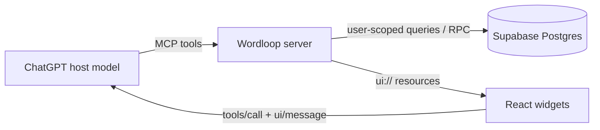

# Wordloop

Wordloop is a persistent vocabulary-state MCP App for ChatGPT-led English learning. It is deliberately not a chatbot and never calls an LLM from the backend. ChatGPT teaches, explains, asks questions, evaluates answers, and analyzes difficult sentences; Wordloop stores the durable state and renders focused interactive views.

## What V1 does

- Migrates an entire Shanbay book once (unlearned, learning, and simple-learned), while retaining manual import as a fallback.
- Keeps one user-specific learning record per normalized word without lemmatization.
- Records pretest classifications and every scored vocabulary attempt.
- Tracks meaning, collocation, grammar, pronunciation, and spelling error layers.
- Clears an individual error layer only after two consecutive correct repairs.
- Uses `ts-fsrs` FSRS v6 as the only long-term scheduling engine.
- Returns the next 5–7 unfinished words in `unknown → uncertain → new` order.
- Returns up to five active-error or FSRS-due candidates without pulling future cards.
- Persists difficult sentences plus ChatGPT-extracted words.
- Renders a Shanbay import card, learning dashboard, pronunciation cards, and dictation player.
- Uses an Apple-inspired visual system: platform typography, translucent functional layers, immediate press feedback, and light/dark/reduced-motion/reduced-transparency modes.
- Uses standard MCP Apps `ui/initialize`, tool-input/tool-result notifications, `tools/call`, `ui/message`, and `ui/update-model-context` through `@modelcontextprotocol/ext-apps`.

## Architecture



The server and UI are separate. Pure data tools do not attach a UI resource. Five render tools attach `_meta.ui.resourceUri` and serve a self-contained HTML resource whose JavaScript and CSS are generated by esbuild. The service-role key exists only in the Node server environment and is never bundled into the widget.

The repository also contains a GPT Sites surface in `build/` and a Cloudflare Worker-compatible MCP entrypoint in `server/worker.ts`. One Sites origin serves the product page and `/api/mcp`; Supabase credentials remain server-side runtime variables and never enter the page or widget bundle. Local Node development continues to use `/mcp`.

The project uses `@modelcontextprotocol/sdk` 1.30.x with `@modelcontextprotocol/ext-apps` 1.7.x, the official compatible package line that supports the stable 2026-01-26 MCP Apps wire methods requested here. Upgrading ext-apps to 2.x requires migrating the MCP server to the new split `@modelcontextprotocol/server`, `node`, and `express` packages.

## Project tree

```text
wordloop/
├── .codex-plugin/plugin.json
├── .openai/hosting.json
├── .app.json
├── .mcp.json
├── build/                     # GPT Sites static surface
│   ├── app.js
│   ├── index.html
│   └── styles.css
├── docs/
│   ├── TEACHING_POLICY.md
│   ├── TEST_REPORT.md
│   └── design/wordloop-concept.png
├── scripts/
│   ├── build-sites-worker.ts
│   ├── build-widgets.ts
│   └── inspect-mcp.mjs
├── server/
│   ├── index.ts
│   ├── mcp.ts
│   ├── mcpCore.ts
│   ├── worker.ts
│   ├── db.ts
│   ├── types.ts
│   ├── integrations/shanbay/
│   │   ├── client.ts
│   │   ├── decode.ts
│   │   ├── importer.ts
│   │   ├── mapper.ts
│   │   └── types.ts
│   ├── services/
│   │   ├── attempts.ts
│   │   ├── fsrsReviews.ts
│   │   ├── fsrsScheduler.ts
│   │   ├── progress.ts
│   │   ├── review.ts
│   │   ├── reviewScheduler.ts
│   │   ├── sentences.ts
│   │   ├── shared.ts
│   │   ├── wordNormalization.ts
│   │   └── words.ts
│   └── tools/
│       ├── getErrorBook.ts
│       ├── getLearningContext.ts
│       ├── getNextRound.ts
│       ├── getProgress.ts
│       ├── helpers.ts
│       ├── importWords.ts
│       ├── prepareDailyNewWords.ts
│       ├── recordAttempt.ts
│       ├── recordPretestResult.ts
│       ├── recordReviewResult.ts
│       ├── renderWidgets.ts
│       ├── setDailyNewWordLimit.ts
│       ├── shanbay.ts
│       └── saveSentence.ts
├── supabase/migrations/
│   ├── 202609130001_initial_wordloop.sql
│   └── 202609130002_fsrs_shanbay.sql
├── tests/
│   ├── mcpHttp.test.ts
│   ├── fsrsReview.test.ts
│   ├── fsrsScheduler.test.ts
│   ├── progress.test.ts
│   ├── reviewScheduler.test.ts
│   ├── site.test.ts
│   ├── supabase.integration.test.ts
│   ├── worker.test.ts
│   ├── shanbayClient.test.ts
│   ├── shanbayDecode.test.ts
│   ├── shanbayImport.test.ts
│   ├── shanbayMapper.test.ts
│   └── wordNormalization.test.ts
├── web/src/
│   ├── components/Button.tsx
│   ├── dashboard/LearningDashboard.tsx
│   ├── dictation/DictationWidget.tsx
│   ├── import/WordImport.tsx
│   ├── pretest/PretestWidget.tsx
│   ├── pronunciation/PronunciationCards.tsx
│   ├── main.tsx
│   ├── mcpBridge.ts
│   └── styles.css
├── .env.example
├── package.json
├── tsconfig.json
└── tsconfig.build.json
```

Generated `dist/`, `node-dist/`, `web/dist/`, and `node_modules/` directories are intentionally excluded from the tree above.

## Environment variables

Copy `.env.example` to `.env` and set:

| Variable | Required | Purpose |
| --- | --- | --- |
| `SUPABASE_URL` | Yes | Supabase project URL used only by the server runtime. |
| `SUPABASE_SERVICE_ROLE_KEY` | Yes | Server-only database credential. Never expose it to widgets or commit it. |
| `DEV_USER_ID` | V1 | UUID used as the authenticated identity until OAuth is added. Every query still scopes by this ID. |
| `SHANBAY_AUTH_TOKEN` | For Shanbay migration | Server-only `auth_token`; never sent to React, ChatGPT, Supabase, logs, or tool arguments. |
| `SHANBAY_COOKIE` | Optional fallback | Full server-only cookie only when `auth_token` is insufficient. |
| `PORT` | No | HTTP port; defaults to `3000`. |
| `HOST` | No | Bind address; defaults to `127.0.0.1`. Use `0.0.0.0` on a hosted platform. |
| `ALLOWED_HOSTS` | Recommended in production | Comma-separated hostnames for DNS-rebinding protection when binding publicly. |
| `PUBLIC_BASE_URL` | Documentation/deploy | Public HTTPS origin used when configuring ChatGPT. |
| `WORDLOOP_ROOT` | Only for unusual launches | Absolute project root if the process is started from another working directory. |
| `ENABLE_WIDGET_PREVIEW` | Development only | Enables `/preview/import`, `/preview/dashboard`, `/preview/pronunciation`, and `/preview/dictation`. |

The client never accepts a `user_id`. The current identity comes only from trusted server configuration. Production OAuth should replace `DEV_USER_ID`, not add it as a tool argument.

## Supabase initialization

1. Create a Supabase project.
2. Open SQL Editor.
3. Run both SQL migrations in filename order. On the deployed Site, [`/setup.sql`](https://wordloop-study.zehaoo.chatgpt.site/setup.sql) contains the combined scripts.
4. Create a random UUID for `DEV_USER_ID`; the first import creates the matching `users` row automatically.
5. Put the project URL and service-role key in `.env` on the server only.

The migration creates the required tables, supporting indexes, per-error-layer repair counters, row-level security, and transactional Postgres functions for imports, attempts, pretests, and sentence capture. RPC execution is revoked from `public`, `anon`, and `authenticated`, then granted only to `service_role` in V1.

## Install and run

Requirements: Node.js 20 or newer and a migrated Supabase project.

```bash
npm install
cp .env.example .env
npm run dev
```

Health check:

```bash
curl http://127.0.0.1:3000/
```

Expected response:

```json
{"name":"wordloop","status":"ok","mcp":"/mcp","version":"0.1.0"}
```

Production build and start:

```bash
npm run build
npm start
```

## MCP tools

### Data tools

| Tool | Role |
| --- | --- |
| `import_words` | Normalize, deduplicate, and persist a daily ordered list. |
| `get_learning_context` | Read today's persisted statuses, recent answer history, review queue, stats, and session rules. |
| `get_next_round` | Select 5–7 unfinished words. |
| `record_pretest_result` | Save `known`, `uncertain`, or `unknown` plus the answer in durable attempt history. |
| `record_attempt` | Save an ordinary exercise and update counters/error repair only; never advance FSRS. |
| `record_review_result` | Advance FSRS exactly once for a genuine independent retrieval. |
| `prepare_daily_new_words` | Allocate the configured daily limit from the vocabulary pool. |
| `set_daily_new_word_limit` | Configure the daily allocation limit from 10 to 100. |
| `get_current_shanbay_book` | Read the current Shanbay book using server-only credentials. |
| `preview_shanbay_book` | Count all three complete source states without importing. |
| `import_shanbay_book` | Idempotently migrate a complete current or ID-selected book into the vocabulary pool. |
| `get_error_book` | Return words that still have active error layers. |
| `save_sentence` | Save a difficult sentence and extracted vocabulary. |
| `get_progress` | Return daily and all-time totals. |

### Render tools

| Tool | UI resource |
| --- | --- |
| `render_word_import` | `ui://wordloop/import.html` |
| `render_pretest_widget` | `ui://wordloop/pretest.html` |
| `render_learning_dashboard` | `ui://wordloop/dashboard.html` |
| `render_pronunciation_cards` | `ui://wordloop/pronunciation.html` |
| `render_dictation_widget` | `ui://wordloop/dictation.html` |

The pretest widget reloads stored daily classifications from Supabase before resuming, so closing Chat and reopening the conversation does not restart completed questions. Its integrated pronunciation view shows the word, American IPA, part of speech, Chinese core meaning, and a user-triggered Play button.

The pronunciation and dictation views call browser `speechSynthesis` only after a button click. If it is unavailable, the view displays `Audio unavailable`. The dictation transcript is not inserted into the visible DOM until the user selects `Show transcript`.

## MCP Inspector

Start Wordloop, then launch the interactive inspector:

```bash
npx @modelcontextprotocol/inspector --web http://127.0.0.1:3000/mcp
```

Choose Streamable HTTP if the transport is not detected automatically. Initialize, run `tools/list`, then exercise data tools in the required order. Database-writing calls require valid Supabase configuration.

The repository also includes a headless strict check:

```bash
npm run test:inspector
```

This builds the project, starts a disposable local Wordloop server, runs Inspector `tools/list --strict`, and probes MCP App metadata/resources. The current result is 19 tools listed with no strict schema failures; all five render tools resolve to `text/html;profile=mcp-app` resources with `prefersBorder: true`.

Suggested database test sequence:

1. `import_words` with the seven acceptance words.
2. `get_learning_context`.
3. `record_pretest_result` for each word.
4. `get_next_round` with `limit: 6`.
5. One incorrect `record_attempt` with a concrete error layer.
6. `get_error_book`.
7. Two correct repair attempts using the same concrete error layer.
8. `get_error_book` again; that layer should be gone.
9. `get_progress`.

For correct repair attempts, pass the layer being tested instead of `none`; this is how Wordloop distinguishes a repaired collocation error from an unrelated correct meaning answer.

## Tests

```bash
npm run typecheck
npm run build
npm test
```

The default suite covers FSRS v6 rating transitions and persistence mapping, exercise/FSRS isolation, due mastered cards, no future-card filler, Shanbay decoding/mapping/pagination/error handling, idempotent multi-book deduplication, error repair, progress, Streamable HTTP initialization, and tool discovery.

## Shanbay migration

Shanbay is an optional, removable one-time migration adapter under `server/integrations/shanbay/`. Wordloop reads the current book through `/wordsapp/user_material_books/current` and can fetch a specified `materialbookId` directly. It imports complete `unlearned_items`, `learning_items`, and `simple_learned_items` pages in database batches, stores IPA and structured Chinese senses, and records many-to-many book provenance in `word_sources`.

No reliable public user-bookshelf endpoint was found, so V1 deliberately does not guess one. The import card supports the current book, refresh-after-switching, and an advanced materialbook ID field. It never switches the user's Shanbay current book. After migration, Shanbay state is metadata only and cannot reset Wordloop state, attempts, errors, or the single FSRS card.

Importing thousands of words fills the vocabulary pool, not today's list. Call `prepare_daily_new_words` to allocate the user's `daily_new_word_limit` (default 50, range 10–100) into the existing pretest workflow.

`tests/supabase.integration.test.ts` runs automatically when `SUPABASE_URL` and `SUPABASE_SERVICE_ROLE_KEY` are present. It creates an isolated temporary user, verifies duplicate imports, records an error, reads the same state through a second independent learning-context call (representing a new ChatGPT conversation), verifies the error persists, clears it after two correct repairs, and deletes the temporary user.

## ChatGPT Developer Mode connection

ChatGPT cannot connect to localhost directly. Deploy the server behind a stable public HTTPS URL first; its MCP endpoint must be:

```text
https://your-wordloop-host.example/mcp
```

Then:

1. In ChatGPT, open **Settings → Apps & Connectors → Advanced settings** and enable **Developer mode**.
2. Create a new developer app/connector.
3. Enter the public `/mcp` URL and select no authentication for this DEV_USER_ID build.
4. Save it, start a new conversation, enable Wordloop, and ask: `导入今天的扇贝单词`.
5. Put the contents of [`docs/TEACHING_POLICY.md`](docs/TEACHING_POLICY.md) into the ChatGPT English Learning Project instructions.
6. Run the acceptance flow from the product brief, close the conversation, start another conversation, and ask `开始英语` to verify database-backed continuity.

## GPT Sites

GPT Sites hosts both Wordloop's product page and its Worker-compatible Streamable HTTP endpoint. The original Node/Express entrypoint remains available for local development, while `server/worker.ts` is bundled for Sites. GPT Sites reserves `/mcp` before it reaches the Worker, so configure ChatGPT with `https://wordloop-study.zehaoo.chatgpt.site/api/mcp` after the Site runtime variables are set.

The page source is tracked in `build/`; `npm run build:sites` embeds it and the MCP App widget assets into `dist/server/index.js`. The page contains no Supabase URL, service-role key, access token, or user-specific data.

Before exposing Wordloop to more than one real user, implement OAuth/authenticated identity. A public unauthenticated endpoint with one `DEV_USER_ID` intentionally behaves as one shared development account.

## Security notes

- Every user-owned database read and write is scoped with the trusted server-side user UUID.
- Tool schemas use Zod and reject invalid dates, enum values, UUIDs, oversized content, and empty required content.
- Transactional SQL functions prevent partial attempt/import updates.
- Tool errors return short messages and do not include stack traces, keys, or access tokens.
- Widgets validate tool results before rendering.
- MCP App HTML declares no external connect or resource domains.
- `.env` and build outputs are ignored by Git.
- The service-role key must never be embedded in deployment client variables, logs, or the widget bundle.

## V1 limitations

- Identity is a server-configured `DEV_USER_ID`; OAuth is not implemented.
- Shanbay has no verified bookshelf-list endpoint in this integration; use current-book refresh or a materialbook ID.
- Shanbay migration depends on an undocumented API and may require refreshing the server-only credential when Shanbay changes it.
- Browser speech synthesis voice and exact pronunciation quality vary by host/device.
- No third-party dictionary or TTS endpoint is included.
- Study-session start/end counters are scaffolded in the database but do not yet have public tools.
- The server keeps active MCP transport sessions in process memory; vocabulary state itself is durable in Supabase.
- A full Supabase integration test cannot pass until credentials and the migration are available.

## Roadmap

1. Replace `DEV_USER_ID` with OAuth-derived identity and add production policies.
2. Add explicit study-session lifecycle tools and a 20-new-word quiz counter.
3. Add import history inspection and reversible import management.
4. Replace browser speech synthesis with a real American-English TTS endpoint if needed.
5. Add FSRS parameter optimization and historical replay tooling after enough real review logs exist.
6. Replace the Shanbay adapter if an official export/API becomes available; do not turn it into continuous sync.

## Teaching boundary

The MCP server instructions remain intentionally short. The full teaching behavior lives in [`docs/TEACHING_POLICY.md`](docs/TEACHING_POLICY.md) and belongs in ChatGPT Project instructions. Wordloop stores state and renders interaction; it does not generate lessons, score answers with a hidden model, or develop a second conversational personality.
