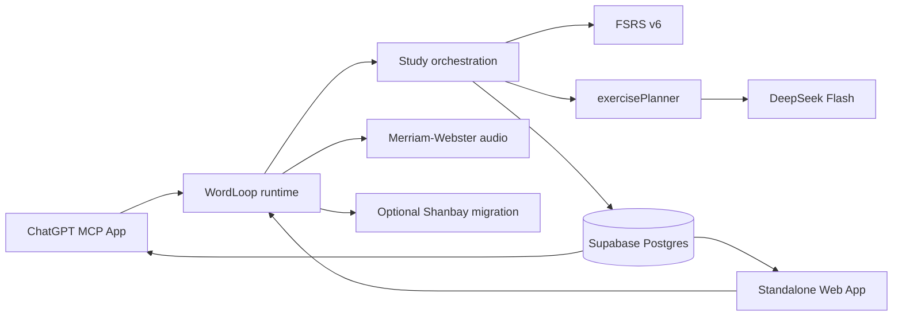

# WordLoop

[English](README.md) · [简体中文](README.zh-CN.md)

WordLoop is a personal English-learning system built around durable study state rather than chat history. It currently exposes the same learning state through two clients:

- a ChatGPT MCP App with interactive widgets;
- a standalone responsive Web App served by the same backend.

Supabase is the source of truth for vocabulary, study sessions, attempts, FSRS state, captured notes, and analytics. WordLoop owns queueing and learning-state transitions; model calls are constrained to content generation and semantic grading.

> Current package version: `0.1.0`  
> Runtime: Node.js 20+, TypeScript, React 19, Supabase/Postgres, MCP Apps, `ts-fsrs`.

## Design principles

WordLoop separates memory scheduling, exercise planning, model generation, and UI rendering.

- **FSRS chooses when a learned word is due.** `ts-fsrs` is the only long-term scheduling engine.
- **WordLoop chooses what comes next.** Daily queues, frozen Lesson rounds, Review snapshots, and study-session cursors are backend-owned.
- **`exercisePlanner` chooses the exercise type.** It freezes `planned_activity_type`, target, skill IDs, hint level, expected duration, and the reason for the choice before content generation.
- **DeepSeek does not choose the queue or exercise type.** It generates Lesson/consolidation content and performs semantic grading under saved schemas and plans.
- **Ordinary exercises do not advance FSRS.** Only genuine formal Review retrievals update the FSRS card.
- **The browser never receives Supabase service-role credentials.**

This boundary is intentionally compatible with future skill-state systems such as OATutor/BKT: a future adapter may supply skill signals to the planner, but it must not become a second scheduler or bypass FSRS.

## Current learning flow

A normal study session is driven by `get_study_bootstrap` and persisted in `study_sessions`.

1. **Formal Review** — only cards in the backend due snapshot are reviewed.
2. **Pretest** — today's new words are classified without exposing the answer first.
3. **Lesson** — a frozen 5–7 word round is taught and exercised one word at a time.
4. **Application / consolidation** — after enough completed formal Lesson words, WordLoop may create one pending long-form task that can be done now or deferred.
5. **Continue** — the backend decides the next durable state; the client does not infer the next word from chat history.

Closing ChatGPT or the standalone page does not reset the active flow. The backend session stores the current phase, word, retry state, generated payload, and navigation cursor.

## Exercise planning

Ordinary Lesson questions are selected by `server/services/exercisePlanner.ts`.

Supported short-task families include:

- word recall / exact cloze;
- short Chinese-to-English translation;
- collocation;
- derivation / word-family tasks.

The planner uses the target sense, part of speech, active error layer, Lesson profile, recent task history, and optional skill signals. Specialized errors and content applicability take precedence over artificial variety.

The current rolling coverage target for ordinary short tasks is:

- at least 3 task families in the latest 20 planned tasks;
- at least 2 short Chinese-to-English tasks;
- extraction-style tasks no more than 75% when the content supports alternatives.

These are planning defaults, not validated psychometric thresholds.

Longer application tasks are recorded separately from ordinary Lesson/Review and may include long-sentence translation, full Chinese-to-English translation, and contextual sentence production. They never update FSRS directly.

## Latency and retry behavior

The current learning path includes a focused latency/reliability pass for semantic Lesson and consolidation work.

- Semantic grading now requests compact feedback with a 600-token output ceiling in the normal path and 900 tokens for repair, instead of the previous 1200/1800 ceilings.
- A first miss does not expose a reference answer; a second miss still requires one. Missing required core feedback can trigger one repair attempt.
- Unassessed semantic dimensions remain unassessed. WordLoop no longer fabricates per-skill correctness from a global verdict.
- Frozen Lesson plans are reused across later words without an unnecessary pre-generation session write. Generation failure persists a retry cursor; successful persistence remains revision-conditional.
- Planner inputs reuse the already loaded queue vocabulary, and standalone planner reads that are independent are issued concurrently.
- `grading_ms` stores measured grading duration. When `WORDLOOP_PERF_LOG=1`, the server emits opt-in phase/model-attempt timing, token-usage and retry-reason diagnostics without logging prompts, answers, API keys or repair text.

These changes do not alter deterministic fixed-answer grading, activity selection, accepted-answer routing or FSRS scheduling. They also do not justify a claimed production latency percentage: the repository has instrumentation, but no production benchmark is asserted.

See `docs/LEARNING_LATENCY_OPTIMIZATION.md` for the exact trade-offs and validation notes.

## Long-term scheduling

WordLoop uses FSRS v6 through `ts-fsrs`.

Current scheduler configuration:

- target retention: `0.90`;
- maximum interval: `36500` days;
- `enable_short_term: false`.

Short-term acquisition and relearning are handled by WordLoop Lesson flows instead of minute-level FSRS learning steps. Review remains the only flow that advances the long-term card.

## Standalone Web App

The root site is a responsive standalone study client. It shares the same Supabase state and backend rules as the MCP App.

Main sections:

- **Today** — today's Review/New-word progress and next action;
- **Study** — Review, Pretest, Lesson, feedback, and pending consolidation;
- **Capture / Notes** — collect words, phrases, collocations, sentences, or grammar snippets with context;
- **Insights** — memory, weakness, due-distribution, and activity analytics;
- **Vocabulary** — searchable/filterable vocabulary with per-word details and FSRS state.

The standalone API is protected by a server-configured Bearer token (`WORDLOOP_WEB_TOKEN`). The user enters the access token in the client; Supabase credentials are never shipped to the browser bundle.

Key endpoints:

```text
GET   /api/web/bootstrap
GET   /api/web/today
GET   /api/web/analytics
GET   /api/web/vocabulary
GET   /api/web/vocabulary/:userWordId
GET   /api/web/captures
POST  /api/web/captures
GET   /api/web/captures/:id
PATCH /api/web/captures/:id
GET   /api/web/captures/:id/occurrences
POST  /api/web/captures/:id/promote
POST  /api/web/action
```

All `/api/web/*` requests require:

```http
Authorization: Bearer <WORDLOOP_WEB_TOKEN>
```

## Capture / Notes

Capture is a first-class part of the standalone app.

A capture can store:

- selected text;
- type: word, phrase, collocation, sentence, or grammar;
- surrounding context;
- source metadata;
- personal notes;
- repeated occurrence history.

The canonical store is `captured_notes` plus `captured_note_occurrences`. Repeated encounters are recorded as occurrences instead of creating uncontrolled duplicates.

Promotion into learning is explicit:

- if the word already exists, WordLoop links it without resetting its status or FSRS state;
- if it is genuinely new, WordLoop may add it to the daily learning flow without modifying the currently frozen round.

## Insights and vocabulary analytics

The standalone Insights surface currently includes:

- long-term first-recall success rate;
- current memory-set size;
- FSRS Stability (S), Difficulty (D), and Retrievability (R);
- due / overdue distribution;
- current active error layers;
- historical error matrix by activity type;
- focus-word ranking;
- formal Review activity, first introductions, and capture activity.

The metric definitions and their limits are documented in:

[`docs/WORDLOOP_INSIGHTS_METRICS.md`](docs/WORDLOOP_INSIGHTS_METRICS.md)

Historical metrics are only shown when the stored events can support them; unavailable history is reported as unavailable rather than fabricated.

## Pronunciation

WordLoop can use Merriam-Webster Learner's Dictionary audio when `MERRIAM_WEBSTER_API_KEY` is configured.

If dictionary audio is unavailable, widgets fall back to local English `speechSynthesis`.

The primary MCP tool is:

```text
get_pronunciation_audio
```

## Shanbay migration

Shanbay is an optional one-time migration adapter under `server/integrations/shanbay/`.

It can import the current book or a specified `materialbookId`, including:

- unlearned items;
- learning items;
- simple-learned items;
- IPA and structured Chinese senses;
- source-book provenance.

Imports are resumable and idempotent. Shanbay state is treated as migration metadata only; re-importing must not reset WordLoop attempts, errors, or FSRS state.

The integration depends on an undocumented Shanbay API and should not be treated as continuous sync.

## ChatGPT MCP App

Local Node development exposes MCP at:

```text
http://127.0.0.1:3000/mcp
```

The GPT Sites / Worker build exposes it at:

```text
https://<your-site>/api/mcp
```

Primary widget resources currently include:

| Surface | Resource |
| --- | --- |
| Import | `ui://wordloop/import.html` |
| Pretest | `ui://wordloop/pretest.html` |
| Review | `ui://wordloop/review.html` |
| Dashboard | `ui://wordloop/dashboard.html` |
| Pronunciation | `ui://wordloop/pronunciation.html` |
| Dictation | `ui://wordloop/dictation-v2.html` |
| Lesson | `ui://wordloop/lesson-v9.html` |

Older Lesson and Dictation URIs remain registered as compatibility aliases for existing conversations.

Important runtime rule: for “start/continue learning”, the first MCP call is `get_study_bootstrap`. The model must follow its returned action and must not reconstruct the queue from chat history.

## Architecture


```mermaid
flowchart LR
  C[ChatGPT MCP App] --> R[WordLoop runtime]
  B[Standalone Web App] --> R

  R --> O[Study orchestration]
  O --> F[FSRS v6]
  O --> P[exercisePlanner]
  O --> S[(Supabase Postgres)]

  P --> D[DeepSeek Flash]
  R --> M[Merriam-Webster audio]
  R --> H[Optional Shanbay migration]

  S --> C
  S --> B
```

The Cloudflare Worker-compatible entrypoint is `server/worker.ts`. Local Node/Express development remains available through `server/index.ts`.

## Project structure

```text
wordloop/
├── build/                         # standalone/GPT Sites shell + manifest
├── docs/
│   ├── TEACHING_POLICY.md
│   ├── WORDLOOP_INSIGHTS_METRICS.md
│   └── migrations/
├── server/
│   ├── integrations/shanbay/
│   ├── services/
│   │   ├── analytics.ts
│   │   ├── capturedNotes.ts
│   │   ├── captureNotes.ts
│   │   ├── deepseek.ts
│   │   ├── exercisePlanner.ts
│   │   ├── fsrsScheduler.ts
│   │   ├── lessonConsolidation.ts
│   │   ├── studyBootstrap.ts
│   │   └── studySessions.ts
│   ├── tools/
│   ├── mcpCore.ts
│   ├── webApi.ts
│   └── worker.ts
├── shared/
├── supabase/migrations/
├── tests/
└── web/src/
    ├── dashboard/
    ├── lesson/
    ├── pretest/
    ├── review/
    └── standalone/
        ├── pages/
        └── components/
```

Generated build outputs and `node_modules/` are omitted here.

## Environment variables

Copy `.env.example` to `.env`, then configure the server runtime.

| Variable | Required | Purpose |
| --- | --- | --- |
| `SUPABASE_URL` | Yes | Supabase project URL. |
| `SUPABASE_SERVICE_ROLE_KEY` | Yes | Server-only database credential. |
| `DEV_USER_ID` | Current single-user build | Trusted server-side user UUID. |
| `DEEPSEEK_API_KEY` | For standalone/model-generated Lesson content | Server-only DeepSeek credential. |
| `WORDLOOP_WEB_TOKEN` | For standalone Web | Bearer token used by `/api/web/*`. |
| `MERRIAM_WEBSTER_API_KEY` | Optional | Learner's Dictionary pronunciation audio. |
| `SHANBAY_AUTH_TOKEN` | Optional | One-time Shanbay import. |
| `SHANBAY_COOKIE` | Optional fallback | Server-only Shanbay cookie when required. |
| `PORT` | No | Local HTTP port, default `3000`. |
| `HOST` | No | Bind address, default `127.0.0.1`. |
| `PUBLIC_BASE_URL` | Deployment | Public origin used by deployment/configuration. |
| `ALLOWED_HOSTS` | Recommended when public | DNS-rebinding protection. |
| `WORDLOOP_ROOT` | Rare | Explicit project root. |
| `ENABLE_WIDGET_PREVIEW` | Development only | Enables local widget preview routes. |
| `WORDLOOP_PERF_LOG` | Optional debugging | Set to `1` to emit model/phase timing and retry diagnostics without logging prompts or answers. |

DeepSeek is currently called with model `deepseek-flash` and thinking disabled. Generated output is validated by Zod before it is accepted into the study flow.

## Database setup

For a fresh database, apply the current `setup.sql`.

For an existing database, apply only the missing migrations in order. Relevant migrations on this branch include:

- `202609290001_capture_notes.sql` — initial Capture storage;
- `20260929120641_captured_notes.sql` — canonical captured-notes model;
- `20260929172617_captured_notes_canonical_adapter.sql` — canonical Capture adapter;
- `20260929172621_analytics_read_models.sql` — analytics read models;
- `20260929184221_progress_scheduled_stability_mean.sql` — scheduled Stability analytics;
- `20260930043404_balanced_exercise_plans.sql` — durable frozen exercise plans;
- `20260930043648_exercise_plan_fk_indexes.sql` — supporting plan indexes.

The explicit filenames above are also part of the repository migration/test contract. Do not run an old `setup.sql` over a live database that already contains user data.

## Install and run

Requirements:

- Node.js 20+;
- a migrated Supabase project.

```bash
npm install
cp .env.example .env
npm run dev
```

Production build:

```bash
npm run build
npm start
```

Useful checks:

```bash
npm run typecheck
npm test
npm run build
npm run check:db
npm run predeploy:check
```

MCP Inspector:

```bash
npx @modelcontextprotocol/inspector --web http://127.0.0.1:3000/mcp
```

Headless MCP validation:

```bash
npm run test:inspector
```

## Security and current limitations

- The current build is still primarily a **single-user / small private-test build**.
- Identity is server-scoped through `DEV_USER_ID`; production multi-user OAuth is not implemented.
- `WORDLOOP_WEB_TOKEN` protects the standalone API, but it is not a replacement for real per-user authentication.
- Supabase service-role credentials, DeepSeek credentials, and Shanbay credentials must remain server-side.
- Study state is durable in Supabase; active MCP transport sessions may still be process-local.
- Shanbay migration relies on an undocumented API.
- Some historical analytics are intentionally unavailable because older events do not contain enough evidence.
- Recent migrations in a feature branch must be applied before the corresponding Capture/Insights/exercise-plan features are used against a database.

## Teaching policy

The human-readable teaching contract is:

[`docs/TEACHING_POLICY.md`](docs/TEACHING_POLICY.md)

The runtime version is maintained in:

[`server/teachingPrompt.ts`](server/teachingPrompt.ts)

These two files should remain synchronized when teaching behavior changes.
