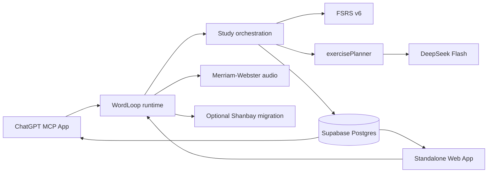

# WordLoop

[English](README.md) · [简体中文](README.zh-CN.md)

WordLoop 是一个以“持久化学习状态”为核心的个人英语学习系统。它不依赖聊天记录猜测你学到哪里，而是把词汇、学习队列、复习状态、练习记录、划词笔记和统计数据统一保存到 Supabase。

目前同一套学习状态可以从两个入口使用：

- ChatGPT 内的 MCP App + 交互式 Widget；
- 独立响应式 Web App。

WordLoop 自己负责学习流程、队列和状态转换；模型只在已经冻结的规则和题型计划下生成教学内容、做复杂语义批改。

> 当前 package 版本：`0.1.0`  
> 技术栈：Node.js 20+、TypeScript、React 19、Supabase/Postgres、MCP Apps、`ts-fsrs`。

## 核心设计

WordLoop 把“记忆调度、选题、模型生成、界面展示”明确分开。

- **FSRS 决定什么时候该复习。** 长期记忆调度只由 `ts-fsrs` 负责。
- **WordLoop 决定下一步学什么。** 每日队列、冻结后的 Lesson 轮次、Review 快照、学习会话游标都由后端决定。
- **`exercisePlanner` 决定出什么题。** 在调用模型前，服务端已经冻结 `planned_activity_type`、训练目标、技能 ID、提示程度、预计时间和选题原因。
- **DeepSeek 不选词、不选题型、不改队列。** 它只根据已经保存的计划生成 Lesson/综合任务内容，并负责需要语义理解的批改。
- **普通练习不会推进 FSRS。** 只有真正的正式 Review 主动回忆才更新长期 FSRS 卡片。
- **浏览器永远拿不到 Supabase service-role key。**

这套边界也为以后接 OATutor/BKT 一类技能状态模型留了接口：未来的技能模型可以给 `exercisePlanner` 提供 `skill_signals`，但不能变成第二套复习调度器，也不能绕过 FSRS。

## 当前学习流程

正常学习流程由 `get_study_bootstrap` 驱动，并持久化在 `study_sessions` 中。

1. **正式 Review**：只复习后端当前 due 快照里的词。
2. **Pretest 预测试**：在不提前泄露答案的情况下判断当天新词掌握情况。
3. **Lesson 正式学习**：每轮冻结 5–7 个词，逐词讲解、练习、反馈。
4. **应用巩固 / consolidation**：完成足够数量的正式 Lesson 词后，系统可以生成一个待完成的综合任务，用户可以现在做，也可以稍后做。
5. **继续学习**：下一步由后端状态决定，客户端不能根据聊天记录自己猜下一个词。

无论关闭 ChatGPT 还是独立网页，当前学习流程都不会因此重置。后端会保存当前阶段、单词、重试状态、已经生成的题面以及导航游标。

## 出题系统

普通 Lesson 的题型由 `server/services/exercisePlanner.ts` 统一选择。

当前短题主要包括：

- 单词主动回忆 / exact cloze；
- 短中译英；
- 搭配；
- 派生词 / 词形任务。

Planner 会综合目标词义、词性、当前错误层、Lesson profile、最近题型历史和可选技能信号。专项错误和“这个词到底适不适合出某种题”优先于为了多样而强行轮换。

目前普通短题的滚动覆盖目标是：

- 最近 20 道至少出现 3 类题型；
- 至少 2 道短中译英；
- 在内容允许时，纯提取/填空类不超过 75%。

这些只是当前规划初值，不是经过心理测量验证的科学阈值。

长难句翻译、完整中译英、情境造句等综合任务与普通 Lesson/Review 分开记录，也不会直接推进 FSRS。

## 延迟优化与重试行为

当前学习链路已经加入一轮专门针对语义 Lesson / consolidation 的延迟与可靠性优化。

- 语义批改正常路径的输出上限从原来的 1200 tokens 收紧到 600，repair 路径从 1800 收紧到 900。
- 第一次答错不会提前泄露 reference answer；第二次答错仍要求提供参考答案。缺失核心反馈时最多触发一次 repair。
- 没有被真正评估的 semantic dimension 会保持 not_assessed，不再根据一个全局 verdict 推导出虚假的逐技能正确率。
- 已冻结的 Lesson plan 在后续单词中直接复用，不再为了生成前 checkpoint 额外写一次 session。生成失败保存 retry cursor，成功写入仍使用 revision 条件保护。
- Planner 会复用已经加载的 queue vocabulary；Standalone 中彼此独立的 planner 读取会并发执行。
- `grading_ms` 保存实际测得的批改耗时；设置 `WORDLOOP_PERF_LOG=1` 后，可以输出阶段耗时、模型 attempt 耗时、token usage 和 retry reason 等诊断信息，同时不记录 prompt、用户答案、API key 或 repair 文本。

这些优化不会改变固定答案题的确定性判分、题型选择逻辑、accepted-answer 路由或 FSRS 调度。仓库目前有性能 instrumentation，但没有据此声称任何生产环境“提速百分比”。

完整说明见 `docs/LEARNING_LATENCY_OPTIMIZATION.md`。

## FSRS 长期记忆调度

WordLoop 通过 `ts-fsrs` 使用 FSRS v6。

当前主要配置：

- 目标记忆率：`0.90`；
- 最大间隔：`36500` 天；
- `enable_short_term: false`。

短期学习和 relearning 由 WordLoop Lesson 负责，不再让 FSRS 产生分钟级学习步骤。长期卡片只在正式 Review 中推进。

## 独立 Web App

站点根路径现在是独立学习客户端，与 MCP App 共用同一套 Supabase 数据、学习队列和后端规则。

主导航包括：

- **今日**：今日复习、新词进度和下一步；
- **学习**：Review、Pretest、Lesson、反馈和待完成综合任务；
- **划词 / Notes**：记录单词、短语、搭配、句子、语法和上下文；
- **洞察**：记忆、薄弱点、到期分布、学习活动统计；
- **词库**：搜索/筛选所有词，并查看单词详情与 FSRS 状态。

独立 Web API 使用服务端配置的 `WORDLOOP_WEB_TOKEN` 做 Bearer 鉴权。用户在客户端输入访问密钥，但 Supabase、DeepSeek 等服务端密钥不会进入前端 bundle。

主要接口：

```text
GET   /api/web/bootstrap
GET   /api/web/today
GET   /api/web/analytics
GET   /api/web/vocabulary
GET   /api/web/vocabulary/:userWordId
GET   /api/web/captures
POST  /api/web/captures
GET   /api/web/captures/:id
PATCH /api/web/captures/:id
GET   /api/web/captures/:id/occurrences
POST  /api/web/captures/:id/promote
POST  /api/web/action
```

所有 `/api/web/*` 请求都需要：

```http
Authorization: Bearer <WORDLOOP_WEB_TOKEN>
```

## 划词笔记 / Capture

Capture 已经是独立 Web 的正式功能。

一条记录可以保存：

- 选中的文本；
- 类型：单词、短语、搭配、句子或语法；
- 所在上下文；
- 来源信息；
- 个人笔记；
- 多次遇到同一表达的 occurrence 历史。

正式数据源是 `captured_notes` + `captured_note_occurrences`。重复遇到同一表达时记录 occurrence，而不是无限制造重复父记录。

是否加入学习由用户明确决定：

- 如果这个词已经存在，只建立关联，不重置原来的状态或 FSRS；
- 如果它确实是新词，可以进入每日学习流程，但不会破坏当前已经冻结的 Lesson 轮次。

## 洞察与词库统计

当前 Insights 包括：

- 长期首次回忆成功率；
- 当前已进入记忆的词数；
- FSRS Stability（S）、Difficulty（D）、Retrievability（R）；
- 逾期 / 今日到期 / 未来到期分布；
- 当前活动错误层；
- 按题型统计的历史错误矩阵；
- 关注词；
- 正式 Review、首次引入和 Capture 活动历史。

每个指标的严格定义和限制写在：

[`docs/WORDLOOP_INSIGHTS_METRICS.md`](docs/WORDLOOP_INSIGHTS_METRICS.md)

如果旧数据本身不足以支持某个历史指标，系统会明确返回 unavailable，不会伪造“完整历史”。

## 发音

配置 `MERRIAM_WEBSTER_API_KEY` 后，WordLoop 可以使用 Merriam-Webster Learner's Dictionary 的美式发音音频。

如果字典音频不可用，Widget 会回退到浏览器本地英文 `speechSynthesis`。

对应 MCP 工具：

```text
get_pronunciation_audio
```

## 扇贝迁移

扇贝目前只是可选的一次性迁移适配器，代码位于 `server/integrations/shanbay/`。

可以导入当前词书或指定 `materialbookId`，包括：

- 未学习；
- 学习中；
- 简单已学习；
- IPA 与结构化中文释义；
- 词书来源记录。

导入支持断点续传和幂等。扇贝只作为迁移来源，重新导入不能重置 WordLoop 已经存在的练习、错误或 FSRS 状态。

由于依赖的是未公开 API，不应把它当作长期双向同步方案。

## ChatGPT MCP App

本地 Node 开发的 MCP 地址：

```text
http://127.0.0.1:3000/mcp
```

GPT Sites / Worker 版本：

```text
https://<your-site>/api/mcp
```

当前主要 Widget resource：

| 功能 | Resource |
| --- | --- |
| 导入 | `ui://wordloop/import.html` |
| Pretest | `ui://wordloop/pretest.html` |
| Review | `ui://wordloop/review.html` |
| Dashboard | `ui://wordloop/dashboard.html` |
| 发音 | `ui://wordloop/pronunciation.html` |
| 听写 | `ui://wordloop/dictation-v2.html` |
| Lesson | `ui://wordloop/lesson-v9.html` |

旧版 Lesson/Dictation URI 仍保留兼容 alias，避免已有对话直接失效。

运行时最重要的一条规则：用户说“开始学习 / 继续学习”时，第一步必须调用 `get_study_bootstrap`，然后严格按它返回的 action 继续，不能靠聊天历史重建队列。

## 架构



Cloudflare Worker 兼容入口是 `server/worker.ts`；本地仍可通过 `server/index.ts` 使用 Node/Express。

## 目录结构

```text
wordloop/
├── build/                         # 独立 Web / GPT Sites shell 与 manifest
├── docs/
│   ├── TEACHING_POLICY.md
│   ├── WORDLOOP_INSIGHTS_METRICS.md
│   └── migrations/
├── server/
│   ├── integrations/shanbay/
│   ├── services/
│   │   ├── analytics.ts
│   │   ├── capturedNotes.ts
│   │   ├── captureNotes.ts
│   │   ├── deepseek.ts
│   │   ├── exercisePlanner.ts
│   │   ├── fsrsScheduler.ts
│   │   ├── lessonConsolidation.ts
│   │   ├── studyBootstrap.ts
│   │   └── studySessions.ts
│   ├── tools/
│   ├── mcpCore.ts
│   ├── webApi.ts
│   └── worker.ts
├── shared/
├── supabase/migrations/
├── tests/
└── web/src/
    ├── dashboard/
    ├── lesson/
    ├── pretest/
    ├── review/
    └── standalone/
        ├── pages/
        └── components/
```

这里省略了生成目录和 `node_modules/`。

## 环境变量

复制 `.env.example` 为 `.env`，然后在服务端配置：

| 变量 | 是否必须 | 用途 |
| --- | --- | --- |
| `SUPABASE_URL` | 是 | Supabase 项目地址。 |
| `SUPABASE_SERVICE_ROLE_KEY` | 是 | 仅服务端使用的数据库凭据。 |
| `DEV_USER_ID` | 当前单用户版本需要 | 服务端可信用户 UUID。 |
| `DEEPSEEK_API_KEY` | 使用独立 Web / 模型生成 Lesson 时需要 | 仅服务端 DeepSeek 密钥。 |
| `WORDLOOP_WEB_TOKEN` | 使用独立 Web 时需要 | `/api/web/*` 的 Bearer token。 |
| `MERRIAM_WEBSTER_API_KEY` | 可选 | Learner's Dictionary 发音。 |
| `SHANBAY_AUTH_TOKEN` | 可选 | 一次性扇贝迁移。 |
| `SHANBAY_COOKIE` | 可选 fallback | 必要时使用的服务端扇贝 Cookie。 |
| `PORT` | 否 | 本地端口，默认 `3000`。 |
| `HOST` | 否 | 默认 `127.0.0.1`。 |
| `PUBLIC_BASE_URL` | 部署时 | 公网 origin。 |
| `ALLOWED_HOSTS` | 公网部署建议 | DNS rebinding 防护。 |
| `WORDLOOP_ROOT` | 极少需要 | 显式项目根目录。 |
| `ENABLE_WIDGET_PREVIEW` | 仅开发 | 开启本地 Widget preview 路由。 |
| `WORDLOOP_PERF_LOG` | 可选调试 | 设为 `1` 后输出模型/阶段耗时与重试诊断，不记录 prompt 或用户答案。 |

当前 DeepSeek 调用模型为 `deepseek-flash`，并关闭 thinking。所有模型输出必须通过 Zod schema 校验后才能进入正式学习流程。

## 数据库初始化

全新数据库直接应用当前 `setup.sql`。

已经存在真实数据的数据库只按顺序补跑缺少的 migration。当前分支的重要迁移包括：

- `202609290001_capture_notes.sql`：初始 Capture 存储；
- `20260929120641_captured_notes.sql`：canonical captured-notes 模型；
- `20260929172617_captured_notes_canonical_adapter.sql`：Capture canonical adapter；
- `20260929172621_analytics_read_models.sql`：analytics read models；
- `20260929184221_progress_scheduled_stability_mean.sql`：scheduled Stability 统计；
- `20260930043404_balanced_exercise_plans.sql`：持久化冻结 exercise plan；
- `20260930043648_exercise_plan_fk_indexes.sql`：对应索引。

上面的显式文件名同时属于仓库的 migration / README 测试契约。不要把旧版 `setup.sql` 重新覆盖到已经有真实数据的数据库上。

## 安装与运行

要求：

- Node.js 20+；
- 已完成 migration 的 Supabase。

```bash
npm install
cp .env.example .env
npm run dev
```

生产构建：

```bash
npm run build
npm start
```

常用检查：

```bash
npm run typecheck
npm test
npm run build
npm run check:db
npm run predeploy:check
```

MCP Inspector：

```bash
npx @modelcontextprotocol/inspector --web http://127.0.0.1:3000/mcp
```

无头严格检查：

```bash
npm run test:inspector
```

## 安全边界与当前限制

- 目前仍主要是**单用户 / 小范围私测版本**。
- 身份仍由服务端 `DEV_USER_ID` 绑定，尚未实现真正的多用户 OAuth。
- `WORDLOOP_WEB_TOKEN` 可以保护独立 Web API，但不能替代正式的逐用户身份系统。
- Supabase service-role、DeepSeek、扇贝等凭据必须留在服务端。
- 学习状态持久化在 Supabase；活动中的 MCP transport session 仍可能是进程内状态。
- 扇贝迁移依赖未公开 API。
- 某些旧历史数据无法支持完整统计，这些指标会明确标记 unavailable。
- feature branch 新增的 Capture / Insights / exercise-plan 功能在使用前必须先把对应 migration 应用到数据库。

## 教学规则

人类可读版本：

[`docs/TEACHING_POLICY.md`](docs/TEACHING_POLICY.md)

运行时注入版本：

[`server/teachingPrompt.ts`](server/teachingPrompt.ts)

以后修改教学行为时，这两处应同步维护。
